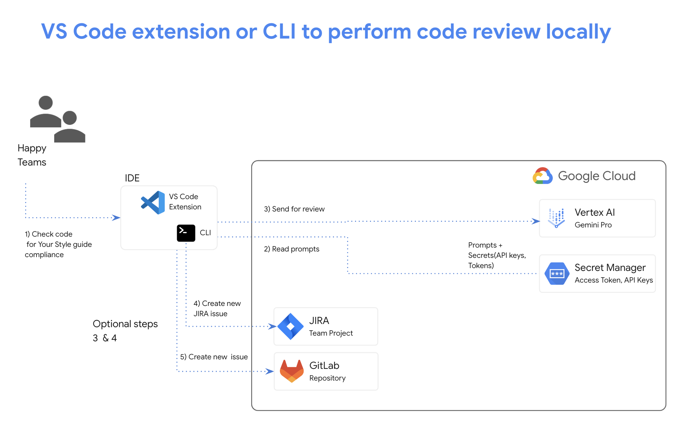

# GenAI for Developers

Generative AI is opening up doors for individuals and businesses alike. Developers can take advantage of this new technology in a myriad of ways, from simplifying mundane tasks, to building applications that take advantage of the latest technology.

In this repository you will find samples, demos and tutorials to help developers take advantage of GenAI.

**This is a demo**. It is not an official Google product.

The contents of this repository should not be considered an official google product. The materials are provided for educational purposes only.

## Integrations
# [DevAI VS Code Extension](./devai-vscode-extension/)

# [DevAI CLI](./devai-cli/)

# [DevAI API](./devai-api/)

## Data Governance

The samples in this repository require you to configure a GCP project for use with the examples. The data is sent to an isolated model within this project and is not accessible by Google or the general public. Additionally Gemini doesn't use your prompts or its responses as data to train its models.

For more information about this topics please review Google's [Data Governance Guide](https://cloud.google.com/gemini/docs/discover/data-governance)

## Contributing

See [`CONTRIBUTING.md`](CONTRIBUTING.md) for details.

## Code of conduct

See [`CODE-OF-CONDUCT.md`](CODE-OF-CONDUCT.md) for details.

## License

Apache 2.0; see [`LICENSE`](LICENSE) for details. 
