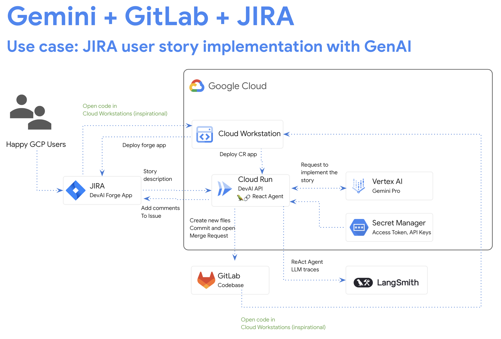

# Devai API

Devai API is a python based application that is built with FastAPI framework.

Devai API application is used in multiple integrations.

## JIRA User story implementation



## Backend/API for GenAI Agent


## Service deployment steps

Set your GCP project and location:

```sh
export PROJECT_ID=YOUR_GCP_PROJECT_ID
export LOCATION=us-central1
```

Authenticate with GCP and set project:

```sh
gcloud auth login
gcloud config set project $PROJECT_ID
```

Set `JIRA_API_TOKEN` and create a secret:

```sh
read -s JIRA_API_TOKEN
export JIRA_API_TOKEN

echo -n $JIRA_API_TOKEN | \
 gcloud secrets create JIRA_API_TOKEN \
 --data-file=-
```
Set `GITLAB_PERSONAL_ACCESS_TOKEN` and create a secret:

```sh
read -s GITLAB_PERSONAL_ACCESS_TOKEN
export GITLAB_PERSONAL_ACCESS_TOKEN

echo -n $GITLAB_PERSONAL_ACCESS_TOKEN | \
 gcloud secrets create GITLAB_PERSONAL_ACCESS_TOKEN \
 --data-file=-
```

Set `LANGCHAIN_API_KEY` and create a secret:

```sh
read -s LANGCHAIN_API_KEY
export LANGCHAIN_API_KEY

echo -n $LANGCHAIN_API_KEY | \
 gcloud secrets create LANGCHAIN_API_KEY \
 --data-file=-
```

Set environment variables:
```sh
export JIRA_USERNAME="YOUR-EMAIL"
export JIRA_INSTANCE_URL="https://YOUR-JIRA-PROJECT.atlassian.net"
export JIRA_PROJECT_KEY="YOUR-JIRA-PROJECT-KEY"

export GITLAB_URL="https://gitlab.com"
export GITLAB_BRANCH="devai"
export GITLAB_BASE_BRANCH="main"
export GITLAB_REPOSITORY="GITLAB-USERID/GITLAB-REPO"

export LANGCHAIN_TRACING_V2=true
export LANGCHAIN_ENDPOINT="https://api.smith.langchain.com"
```

Deploy service to Cloud Run:

Change location:
```sh
cd ~/genai-for-developers/devai-api
```

Deploy application:

```sh
gcloud beta run deploy devai-api \
  --source=. \
  --region="$LOCATION" \
  --allow-unauthenticated \
  --service-account vertex-client \
  --set-env-vars PROJECT_ID="$PROJECT_ID" \
  --set-env-vars LOCATION="$LOCATION" \
  --set-env-vars GITLAB_URL="$GITLAB_URL" \
  --set-env-vars GITLAB_REPOSITORY="$GITLAB_REPOSITORY" \
  --set-env-vars GITLAB_BRANCH="$GITLAB_BRANCH" \
  --set-env-vars GITLAB_BASE_BRANCH="$GITLAB_BASE_BRANCH" \
  --set-env-vars JIRA_USERNAME="$JIRA_USERNAME" \
  --set-env-vars JIRA_INSTANCE_URL="$JIRA_INSTANCE_URL" \
  --set-env-vars JIRA_PROJECT_KEY="$JIRA_PROJECT_KEY" \
  --set-env-vars LANGCHAIN_TRACING_V2="$LANGCHAIN_TRACING_V2" \
  --update-secrets="LANGCHAIN_API_KEY=LANGCHAIN_API_KEY:latest" \
  --update-secrets="GITLAB_PERSONAL_ACCESS_TOKEN=GITLAB_PERSONAL_ACCESS_TOKEN:latest" \
  --update-secrets="JIRA_API_TOKEN=JIRA_API_TOKEN:latest" \
  --min-instances=1 \
  --max-instances=3 \
  --service-min-instances=1
```
