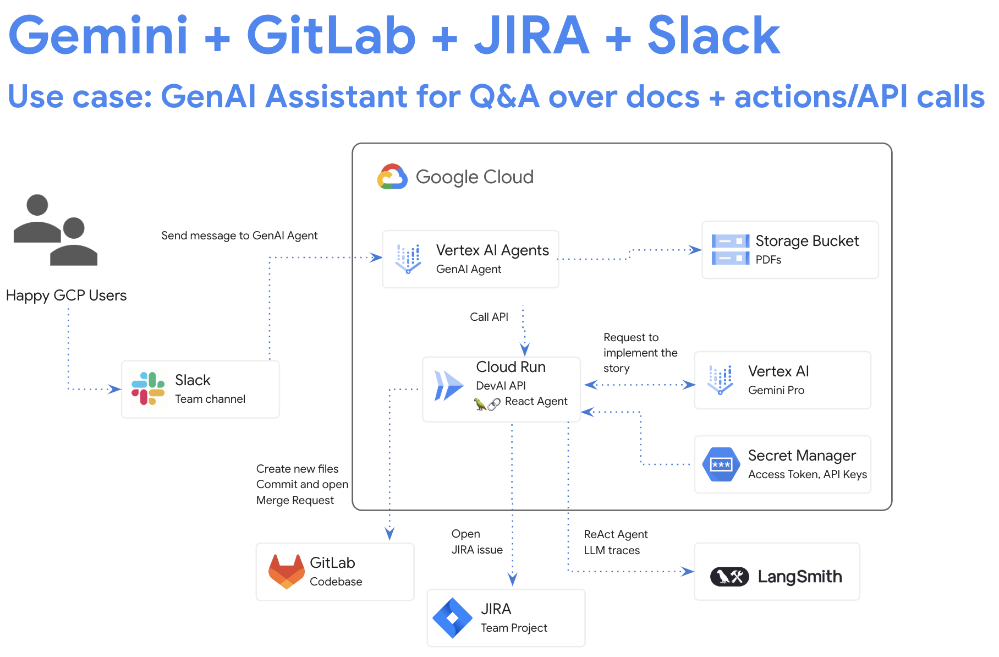

# Devai API

Devai API is a python based application that is built with FastAPI framework.

This application defines the routes for the DevAI API. 

The API provides two main endpoints:

`/create-gitlab-mr`: This endpoint takes a user prompt as input and uses the Gemini model to generate code and documentation based on the prompt.

`/generate`: This endpoint takes a user prompt as input and uses the Gemini model to generate code and documentation based on the prompt.

`/create-jira-issue`: This endpoint takes a user prompt as input and uses the Gemini model to generate a detailed technical prompt for a JIRA user story based on the input requirements.

`/create-github-pr`: This endpoint takes a user prompt as input and uses the Gemini model to generate documentation based and opens GitHub pull request with updated README.md file.

The API includes a `/test` endpoint for testing purposes.

The code uses the following libraries:

- FastAPI: A web framework for building APIs in Python.
- Google Cloud AI Platform: A cloud service for building and deploying machine learning models.
- LangChain: A library for building and deploying language models.
- Vertex AI: A cloud service for building and deploying machine learning models.
- Jira: A project management tool.
- GitLab: A code hosting platform.

The code uses the following environment variables:

- PROJECT_ID: The Google Cloud project ID.
- LOCATION: The Google Cloud region.

For integration with JIRA:

- JIRA_API_TOKEN: The JIRA API token.
- JIRA_USERNAME: The JIRA username.
- JIRA_INSTANCE_URL: The JIRA instance URL.
- JIRA_PROJECT_KEY: The JIRA project key.
- JIRA_CLOUD: Required for LangChain JiraAPIWrapper

For integration with GitLab:

- GITLAB_URL: The GitLab URL.
- GITLAB_REPOSITORY: The GitLab repository.
- GITLAB_BRANCH: The GitLab branch.
- GITLAB_BASE_BRANCH: The GitLab base branch.

For integration with GitHub:

- GITHUB_APP_ID: The GitHub App id.
- GITHUB_ACCOUNT: The GitHub account(org or userid).
- GITHUB_REPO_NAME: The GitHub repository name.
- GITHUB_APP_INSTALLATION_ID: The GitHub App installation id.

GitHub App setup [details](../docs/tutorials/setup-github.md).

For integration with LangSmith:

- LANGCHAIN_TRACING_V2: The LangChain tracing flag.
- LANGCHAIN_ENDPOINT: The LangChain endpoint.

The code uses the following secrets:

- LANGCHAIN_API_KEY: The LangChain API key.
- GITLAB_PERSONAL_ACCESS_TOKEN: The GitLab personal access token.
- JIRA_API_TOKEN: The JIRA API token.
- GITHUB_APP_PRIVATE_KEY: GitHub App private key.

## JIRA User story implementation


## Backend/API for GenAI Agent



## Service deployment steps

Set your GCP project and location:

```sh
export PROJECT_ID=YOUR_GCP_PROJECT_ID
export LOCATION=us-central1
```

Authenticate with GCP and set project:

```sh
gcloud auth login
gcloud config set project $PROJECT_ID
```

Enable APIs
```sh
gcloud services enable \
    aiplatform.googleapis.com \
    cloudaicompanion.googleapis.com \
    cloudresourcemanager.googleapis.com \
    secretmanager.googleapis.com \
    run.googleapis.com \
    cloudbuild.googleapis.com \
    artifactregistry.googleapis.com \
    logging.googleapis.com
```

Set `JIRA_API_TOKEN` and create a secret([details](../docs/tutorials/setup-jira.md)):

```sh
read -s JIRA_API_TOKEN
export JIRA_API_TOKEN

echo -n $JIRA_API_TOKEN | \
 gcloud secrets create JIRA_API_TOKEN \
 --data-file=-
```
Set `GITLAB_PERSONAL_ACCESS_TOKEN` and create a secret([details](../docs/tutorials/setup-gitlab.md)):

```sh
read -s GITLAB_PERSONAL_ACCESS_TOKEN
export GITLAB_PERSONAL_ACCESS_TOKEN

echo -n $GITLAB_PERSONAL_ACCESS_TOKEN | \
 gcloud secrets create GITLAB_PERSONAL_ACCESS_TOKEN \
 --data-file=-
```

Set `GITHUB_APP_PRIVATE_KEY` and create a secret([details](../docs/tutorials/setup-github.md)):

```sh
gcloud secrets create GITHUB_APP_PRIVATE_KEY \
  --data-file="/tmp/path-to-your-github-app.private-key.pem"
```

Set `LANGCHAIN_API_KEY` and create a secret([details](../docs/tutorials/setup-langsmith.md)):

```sh
read -s LANGCHAIN_API_KEY
export LANGCHAIN_API_KEY

echo -n $LANGCHAIN_API_KEY | \
 gcloud secrets create LANGCHAIN_API_KEY \
 --data-file=-
```

Set `DEVAI_API_KEY` and create a secret([Create new API key](https://console.cloud.google.com/apis/credentials)):

```sh
read -s DEVAI_API_KEY
export DEVAI_API_KEY

echo -n $DEVAI_API_KEY | \
 gcloud secrets create DEVAI_API_KEY \
 --data-file=-
```

Set environment variables:
```sh
export JIRA_USERNAME="YOUR-EMAIL"
export JIRA_INSTANCE_URL="https://YOUR-JIRA-PROJECT.atlassian.net"
export JIRA_PROJECT_KEY="YOUR-JIRA-PROJECT-KEY"
export JIRA_CLOUD=true

export GITLAB_URL="https://gitlab.com"
export GITLAB_BRANCH="devai"
export GITLAB_BASE_BRANCH="main"
export GITLAB_REPOSITORY="GITLAB-USERID/GITLAB-REPO"

export LANGCHAIN_TRACING_V2=true
export LANGCHAIN_ENDPOINT="https://api.smith.langchain.com"

export GITHUB_APP_ID=APP_ID
export GITHUB_ACCOUNT="YOUR-USERID"
export GITHUB_REPO_NAME="REPO-NAME"
export GITHUB_APP_INSTALLATION_ID=INSTALLATION_ID
```

Deploy service to Cloud Run:

Change location:
```sh
cd ~/genai-for-developers/devai-api
```

Deploy application:

### Configure Service Account for Cloud Run application

Run commands below to create service account.

```sh
PROJECT_ID=$(gcloud config get-value project)
PROJECT_NUMBER=$(gcloud projects describe $PROJECT_ID --format='value(projectNumber)')
SERVICE_ACCOUNT_NAME='vertex-client'
DISPLAY_NAME='Vertex Client'
KEY_FILE_NAME='vertex-client-key'

gcloud iam service-accounts create $SERVICE_ACCOUNT_NAME --display-name "$DISPLAY_NAME"
```

Grant roles for Cloud Run service account:
```sh
gcloud projects add-iam-policy-binding $PROJECT_ID --member="serviceAccount:$SERVICE_ACCOUNT_NAME@$PROJECT_ID.iam.gserviceaccount.com" --role="roles/aiplatform.admin" --condition None

gcloud projects add-iam-policy-binding $PROJECT_ID --member="serviceAccount:$SERVICE_ACCOUNT_NAME@$PROJECT_ID.iam.gserviceaccount.com" --role="roles/secretmanager.secretAccessor" --condition None
```

Grant roles for default compute account:
```sh
gcloud projects add-iam-policy-binding $PROJECT_ID \
 --member=serviceAccount:$PROJECT_NUMBER-compute@developer.gserviceaccount.com \
 --role=roles/run.builder
```

### Deploy Cloud Run application:

```sh
gcloud run deploy devai-api \
  --source=. \
  --region="$LOCATION" \
  --allow-unauthenticated \
  --service-account vertex-client \
  --set-env-vars PROJECT_ID="$PROJECT_ID" \
  --set-env-vars LOCATION="$LOCATION" \
  --set-env-vars GITLAB_URL="$GITLAB_URL" \
  --set-env-vars GITLAB_REPOSITORY="$GITLAB_REPOSITORY" \
  --set-env-vars GITLAB_BRANCH="$GITLAB_BRANCH" \
  --set-env-vars GITLAB_BASE_BRANCH="$GITLAB_BASE_BRANCH" \
  --set-env-vars JIRA_USERNAME="$JIRA_USERNAME" \
  --set-env-vars JIRA_INSTANCE_URL="$JIRA_INSTANCE_URL" \
  --set-env-vars JIRA_PROJECT_KEY="$JIRA_PROJECT_KEY" \
  --set-env-vars LANGCHAIN_TRACING_V2="$LANGCHAIN_TRACING_V2" \
  --set-env-vars JIRA_CLOUD="$JIRA_CLOUD" \
  --set-env-vars GITHUB_APP_ID=$GITHUB_APP_ID \
  --set-env-vars GITHUB_ACCOUNT="$GITHUB_ACCOUNT" \
  --set-env-vars GITHUB_REPO_NAME="$GITHUB_REPO_NAME" \
  --set-env-vars GITHUB_APP_INSTALLATION_ID="$GITHUB_APP_INSTALLATION_ID" \
  --update-secrets="LANGCHAIN_API_KEY=LANGCHAIN_API_KEY:latest" \
  --update-secrets="GITLAB_PERSONAL_ACCESS_TOKEN=GITLAB_PERSONAL_ACCESS_TOKEN:latest" \
  --update-secrets="JIRA_API_TOKEN=JIRA_API_TOKEN:latest" \
  --update-secrets="GITHUB_APP_PRIVATE_KEY=GITHUB_APP_PRIVATE_KEY:latest" \
  --update-secrets="DEVAI_API_KEY=DEVAI_API_KEY:latest" \
  --min-instances=1 \
  --max-instances=3
```
