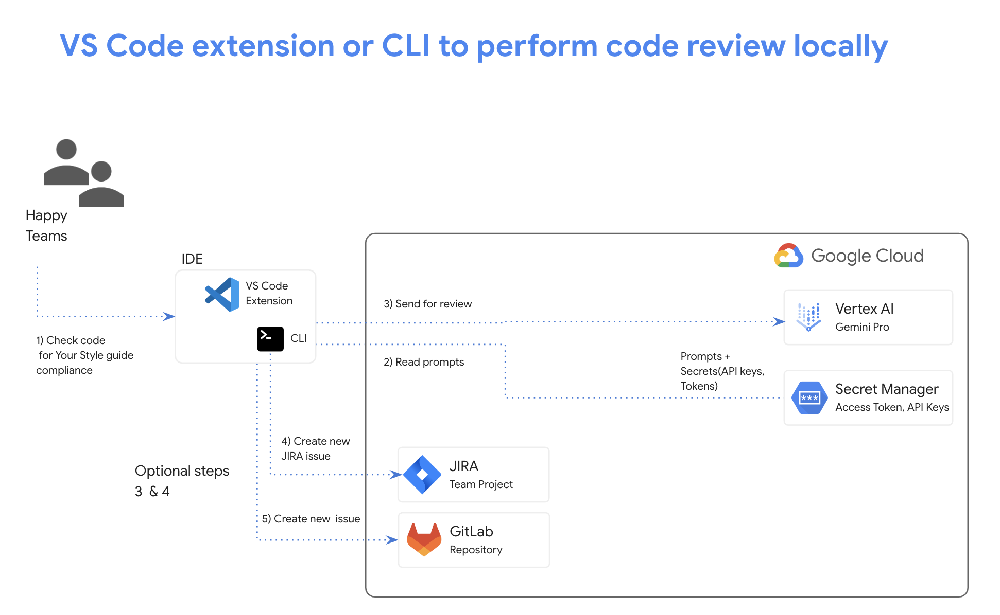

# Devai VS Code extension for local code review

### Devai VS Code extension is based on Pipet Code Agent project: https://ai.google.dev/gemini-api/tutorials/pipet-code-agent 

Devai extension was extended to do prompt lookup in Secret Manager.



###  Custom commands in VS Code


### Review Output - markdown preview for readability


### Custom Review Prompt in Secret Manager


Save review prompt in Secret Manager:

```sh
gcloud secrets create CUSTOM_REVIEW_PROMPT --data-file=CUSTOM_REVIEW_PROMPT.txt
 ```


## Setup

Install dependencies:

```sh
cd devai-vscode-extension

npm install
```

Compile the extension:

```sh
npm run compile
```

Start debugging - open `src/extension.ts` and select from the top level menu:

```
Run > Start Debugging
```

Select `VS Code Extension Development`.


## Publishing Extension

Install Visual Studio Code Extensions(vsce) cli:

```sh
npm install -g @vscode/vsce
```

Package the extension:

```sh
cd devai-vscode-extension

vsce package

# devai-vscode-extension.vsix generated
```
Install extension from VSIX:


Learn more: https://code.visualstudio.com/api/working-with-extensions/publishing-extension