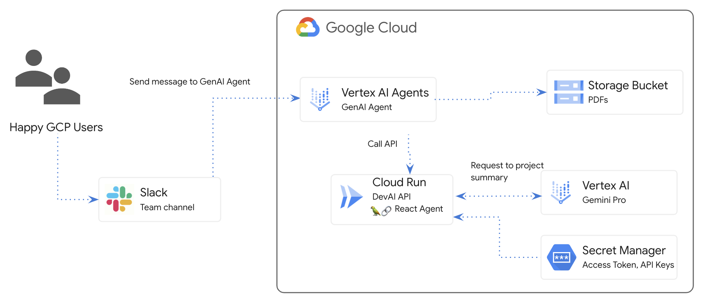

# GenAI agent for QA over docs and API calls

## Overview

In this lab, you will create a GenAI Agent, connect it to the Cloud Run application and integrate the agent into the Slack workspace.



### What you will learn

There are several main parts to the lab:

* Deploy Cloud Run application to integrate with Gemini APIs
* Create and deploy Vertex AI Agent
* Integrate Agent into Slack
* Configure data store for Q&A over PDF documents


## Setup and Requirements

### Cloud Project setup

Sign-in to the  [Google Cloud Console](http://console.cloud.google.com) and create a new project or reuse an existing one. If you don't already have a Gmail or Google Workspace account, you must  [create one](https://accounts.google.com/SignUp).

## Clone the repo

Open Google Cloud Console and activate Cloud Shell by clicking on the icon to the right of the search bar.


In the opened terminal, run following commands

```
git clone https://github.com/GoogleCloudPlatform/genai-for-developers.git

cd genai-for-developers

git checkout slack-agent-jira-lab
```

Click "Open Editor"
Using the "`File / Open Folder`" menu item, open "`genai-for-developers`".
Open a new terminal.


## Create Service Account


Create a new service account and keys.

You will use this service account to make API calls to Vertex AI Gemini API from Cloud Run application.

Configure project details using your GCP project details.

Example: `gcp-00-2c10937585bb`

```
gcloud config set project YOUR_GCP_PROJECT_ID
```

Create service account and grant roles.

```
export LOCATION=us-central1
export PROJECT_ID=$(gcloud config get-value project)
export SERVICE_ACCOUNT_NAME='vertex-client'
export DISPLAY_NAME='Vertex Client'
export KEY_FILE_NAME='vertex-client-key'

gcloud iam service-accounts create $SERVICE_ACCOUNT_NAME --project $PROJECT_ID --display-name "$DISPLAY_NAME"

gcloud projects add-iam-policy-binding $PROJECT_ID --member="serviceAccount:$SERVICE_ACCOUNT_NAME@$PROJECT_ID.iam.gserviceaccount.com" --role="roles/aiplatform.admin"

gcloud projects add-iam-policy-binding $PROJECT_ID --member="serviceAccount:$SERVICE_ACCOUNT_NAME@$PROJECT_ID.iam.gserviceaccount.com" --role="roles/aiplatform.user"

gcloud projects add-iam-policy-binding $PROJECT_ID --member="serviceAccount:$SERVICE_ACCOUNT_NAME@$PROJECT_ID.iam.gserviceaccount.com" --role="roles/cloudbuild.builds.editor"

gcloud projects add-iam-policy-binding $PROJECT_ID --member="serviceAccount:$SERVICE_ACCOUNT_NAME@$PROJECT_ID.iam.gserviceaccount.com" --role="roles/artifactregistry.admin"

gcloud projects add-iam-policy-binding $PROJECT_ID --member="serviceAccount:$SERVICE_ACCOUNT_NAME@$PROJECT_ID.iam.gserviceaccount.com" --role="roles/storage.admin"

gcloud projects add-iam-policy-binding $PROJECT_ID --member="serviceAccount:$SERVICE_ACCOUNT_NAME@$PROJECT_ID.iam.gserviceaccount.com" --role="roles/run.admin"

gcloud projects add-iam-policy-binding $PROJECT_ID --member="serviceAccount:$SERVICE_ACCOUNT_NAME@$PROJECT_ID.iam.gserviceaccount.com" --role="roles/secretmanager.secretAccessor"


gcloud iam service-accounts keys create $KEY_FILE_NAME.json --iam-account=$SERVICE_ACCOUNT_NAME@$PROJECT_ID.iam.gserviceaccount.com
```

 If prompted to authorize, click "Authorize" to continue.

Enable required services to use Vertex AI APIs and Gemini chat.

```
gcloud services enable \
    generativelanguage.googleapis.com \
    aiplatform.googleapis.com \
    cloudaicompanion.googleapis.com \
    run.googleapis.com \
    cloudresourcemanager.googleapis.com
```

Enable required services to use Vertex AI APIs and Gemini chat.

```
gcloud services enable \
    artifactregistry.googleapis.com \
    cloudbuild.googleapis.com \
    runapps.googleapis.com \
    workstations.googleapis.com \
    servicemanagement.googleapis.com \
    secretmanager.googleapis.com \
    containerscanning.googleapis.com
```

### Enable Gemini Code Assist

Click on the "Gemini" icon, in the bottom right corner, click "`Sign-in`" and "`Select Google Cloud project`".

From the popup window, select your GCP project.

Open file "`devai-api/app/routes.py`" and then right click anywhere in the file and select "`Gemini Code Assist > Explain this"` from the context menu.

Review Gemini's explanation for the selected file.


## Deploy Devai-API to Cloud Run


Check that you are in the right folder.

```
cd ~/genai-for-developers/devai-api
```

For this lab, we follow best practices and use  [Secret Manager](https://cloud.google.com/run/docs/configuring/services/secrets) to store and reference the Access Token and LangChain API Key values in Cloud Run.

Set environment variables.

```
export JIRA_API_TOKEN=your-jira-token
export JIRA_USERNAME="YOUR-EMAIL"
export JIRA_INSTANCE_URL="https://YOUR-JIRA-PROJECT.atlassian.net"
export JIRA_PROJECT_KEY="YOUR-JIRA-PROJECT-KEY"
export JIRA_CLOUD=true

export GITLAB_PERSONAL_ACCESS_TOKEN=your-gitlab-token
export GITLAB_URL="https://gitlab.com"
export GITLAB_BRANCH="devai"
export GITLAB_BASE_BRANCH="main"
export GITLAB_REPOSITORY="GITLAB-USERID/GITLAB-REPO"

export LANGCHAIN_API_KEY=your-langchain-key
export LANGCHAIN_TRACING_V2=true
export LANGCHAIN_ENDPOINT="https://api.smith.langchain.com"
```

Store JIRA Access Token in the Secret Manager.

```
echo -n $JIRA_API_TOKEN | \
 gcloud secrets create JIRA_API_TOKEN \
 --data-file=-
```

Store GitLab Access Token in the Secret Manager.

```
echo -n $GITLAB_PERSONAL_ACCESS_TOKEN | \
 gcloud secrets create GITLAB_PERSONAL_ACCESS_TOKEN \
 --data-file=-
```

Store LangChain API Key in the Secret Manager.

```
echo -n $LANGCHAIN_API_KEY | \
 gcloud secrets create LANGCHAIN_API_KEY \
 --data-file=-
```

Deploy application to Cloud Run.

```
gcloud run deploy devai-api \
  --source=. \
  --region="$LOCATION" \
  --allow-unauthenticated \
  --service-account vertex-client \
  --set-env-vars PROJECT_ID="$PROJECT_ID" \
  --set-env-vars LOCATION="$LOCATION" \
  --set-env-vars GITLAB_URL="$GITLAB_URL" \
  --set-env-vars GITLAB_REPOSITORY="$GITLAB_REPOSITORY" \
  --set-env-vars GITLAB_BRANCH="$GITLAB_BRANCH" \
  --set-env-vars GITLAB_BASE_BRANCH="$GITLAB_BASE_BRANCH" \
  --set-env-vars JIRA_USERNAME="$JIRA_USERNAME" \
  --set-env-vars JIRA_INSTANCE_URL="$JIRA_INSTANCE_URL" \
  --set-env-vars JIRA_PROJECT_KEY="$JIRA_PROJECT_KEY" \
  --set-env-vars JIRA_CLOUD="$JIRA_CLOUD" \
  --set-env-vars LANGCHAIN_TRACING_V2="$LANGCHAIN_TRACING_V2" \
  --update-secrets="LANGCHAIN_API_KEY=LANGCHAIN_API_KEY:latest" \
  --update-secrets="GITLAB_PERSONAL_ACCESS_TOKEN=GITLAB_PERSONAL_ACCESS_TOKEN:latest" \
  --update-secrets="JIRA_API_TOKEN=JIRA_API_TOKEN:latest" \
  --min-instances=1 \
  --max-instances=3
```

Answer `Y` to create Artifact Registry Docker  repository.

```
Deploying from source requires an Artifact Registry Docker repository to store built containers. A repository named [cloud-run-source-deploy] in 
region [us-central1] will be created.

Do you want to continue (Y/n)?  y
```
Ask Gemini to explain the command.

## Test API

Test endpoint by running curl command.

```
curl -X POST \
   -H "Content-Type: application/json" \
   -d '{"prompt": "PROJECT-100"}' \
   $(gcloud  run services list --filter="(devai-api)" --format="value(URL)")/generate
```

Review output.

## Vertex AI Agent Builder

Search and open "Agent Builder" in the Cloud Console.

Activate APIs and create a new Agent app.
Type "Agent" for Display name and click "Agree & Create".

Set Goal:

```
Help user with questions about JIRA project
```

Set Instructions:

```
- Greet the users, then ask how you can help them today.
- Summarize the user's request and ask them to confirm that you understood correctly.
  - If necessary, seek clarifying details.
- Thank the user for their business and say goodbye.
```

Click "Save".


Test the Agent using emulator chat on the right side by asking a test question.

### Tool configuration

Open Tools menu and create a new Tool.


Select `OpenAPI` from the Type dropdown.

Set Tool Name:

```
jira-project-status
```

Set Description:

```
Returns JIRA project status
```

Set Schema (YAML) - replace YOUR CLOUD RUN URL.

```
openapi: 3.0.0
info:
 title: CR API
 version: 1.0.0
 description: >-
   This is the OpenAPI specification of a service.
servers:
 - url: 'https://YOUR CLOUD RUN URL'
paths:
 /create-jira-issue:
   post:
     summary: Request impl
     operationId: create-jira-issue
     requestBody:
       description: Request impl
       required: true
       content:
         application/json:
           schema:
             $ref: '#/components/schemas/Prompt'
     responses:
       '200':
         description: Generated
         content:
           application/json:
             schema:
               type: string
 /generate:
   post:
     summary: Request impl
     operationId: generate
     requestBody:
       description: Request impl
       required: true
       content:
         application/json:
           schema:
             $ref: '#/components/schemas/Prompt'
     responses:
       '200':
         description: Generated
         content:
           application/json:
             schema:
               type: string

 /test:
   get:
     summary: Request impl
     operationId: test
     responses:
       '200':
         description: Generated
         content:
           application/json:
             schema:
               type: string                    
components:
 schemas:
   Prompt:
     type: object
     required:
       - prompt
     properties:
       prompt:
         type: string
```

Save the Tool configuration.

### Agent configuration

Return to Agent configuration and update instructions to use the tool.

Add instructions to use new tool:

```
- Use ${TOOL: jira-project-status} to help the user with JIRA project status.
```

Switch to Examples tab and add new example:


Set Display Name:

```
jira-project-flow
```

Using menu at the bottom, model the conversation between user and agent.
Using the `+` icon next ti chat prompt, you can select `Agent response` and `User input` to create an example conversation.

```
Agent response: How can I help you today?
User input: I need to understand JIRA project status
Agent reponse: Whats the JIRA PROJECT ID?
User input: TEST-PROJECT-100
Tool invocation: jira-project-status, action "generate"
Agent reponse: Project status for TEST-PROJECT-100
User input: Thank you
Agent response: Can I help you with anything else?
User input: No, thank you
```

Tool invocation configuration:
Tool and action name:
```
jira-project-status
generate
```
Tool input:
```
{
    "prompt": "TEST-PROJECT-100"
}
```
Tool output:
```
"Project status for TEST-PROJECT-100"
```

Click Save and Cancel. Return to the Agent emulator and test the flow.


Review  [Best Practices](https://cloud.google.com/dialogflow/vertex/docs/concept/best-practices) for Vertex AI Agents


### Slack Integration

Open the Integrations menu and click "Connect" on the Slack tile.

Open the link and create a new Slack app at  [https://api.slack.com/apps](https://api.slack.com/apps) 

Select "From an app manifest" option.

Pick a workspace to develop your app.

Switch to YAML and paste this manifest:

```
display_information:
  name: Agent
  description: Agent
  background_color: "#1148b8"
features:
  app_home:
    home_tab_enabled: false
    messages_tab_enabled: true
    messages_tab_read_only_enabled: false
  bot_user:
    display_name: Agent
    always_online: true
oauth_config:
  scopes:
    bot:
      - app_mentions:read
      - chat:write
      - im:history
      - im:read
      - im:write
      - incoming-webhook
settings:
  event_subscriptions:
    request_url: https://dialogflow-slack-4vnhuutqka-uc.a.run.app
    bot_events:
      - app_mention
      - message.im
  org_deploy_enabled: false
  socket_mode_enabled: false
  token_rotation_enabled: false
```

Click "Create".

Install to Workspace.

Select "#general" channel and click "Allow".

Under "Basic Information / App Credentials" - copy "Signing Secret"  and set it in Slack integration for "Signing Secret" field.

Open "OAuth & Permissions" and copy "Bot User OAuth Token" and set it in Slack integration for "Access Token" field.


Set the required fields and click "Start".

Agent's "**Access Token**" value is **"Bot User OAUth Token" from Slack**.

Agent's "**Signing Token**" value is **"Signing Secret" from Slack.**


Copy "Webhook URL" and return to Slack app configuration.

Open the "Event Subscriptions" section and paste the url.


Save the changes.

## Test Agent in Slack

Open "Slack" and add an agent by typing "@Agent".

Ask the agent for a JIRA project summary.


## Q&A over PDF documents


### Create Cloud Storage Bucket

Open GCS in the Cloud Console:  [https://console.cloud.google.com/storage/browser](https://console.cloud.google.com/storage/browser) 

Create a new bucket.

For bucket name type: "`pdf-docs`" + last 5 digits of your GCP project.

Location type: `multi-region, us`.

Storage class: `Standard`

Access control: `Uniform`

Data protection: `uncheck soft delete policy`

Click "`Create`".

Confirm "Public access will be prevented".

Download PDF report and upload it to the bucket.
[https://services.google.com/fh/files/misc/exec_guide_gen_ai.pdf](https://services.google.com/fh/files/misc/exec_guide_gen_ai.pdf) 

Bucket with uploaded file view:


### Data store configuration

Return to Agent Console and open "`Agent`", scroll down and click "`+ Data store`".


Use following values:

Tool name: `pdf-docs`

Type: `Data store`

Description: `pdf-docs`

Click "`Save`" 


Click the "`Create a data store`" at the bottom on the page.

Click "`AGREE`" when asked about "Do you agree to have your search & conversation data stores in the us region?"

Type "`Google`" in the "Provide Company" field.

On the next screen, click "`CREATE DATA STORE`".

Select "`Cloud Storage`" as data source.

Prepare data for ingesting

[https://cloud.google.com/generative-ai-app-builder/docs/prepare-data](https://cloud.google.com/generative-ai-app-builder/docs/prepare-data) 
```
HTML and TXT files must be 2.5 MB or smaller. 

PDF, PPTX, and DOCX files must be 100 MB or smaller. 

You can import up to 100,000 files at a time.
```
Select: `unstructured documents`

And select your GCS bucket/folder.


Click continue.


For data store name type: "`pdf-docs`"

Select "`Digital parser`" from the dropdown.

Enable advanced chunking.

Enable ancestor headings in chunks.

Click "`Create`".


Select data store and click "`Create`"


Click on the data store and review Documents, Activity and Processing Config.


It will take ~5-10 minutes to complete the import.


#### Parsing and Chunking options

You can control content parsing in the following ways:

* **Digital parser.** The digital parser is on by default for all file types unless a different parser type is specified. The digital parser processes ingested documents if no other default parser is specified for the data store or if the specified parser doesn't support the file type of an ingested document.
* **OCR parsing for PDFs**. Public preview. If you plan to upload scanned PDFs or PDFs with text inside images, you can turn on the OCR parser to improve PDF indexing. See  [About OCR parsing for PDFs](https://cloud.google.com/generative-ai-app-builder/docs/parse-chunk-documents#parsing-pdfs).
* **Layout parser.** Public preview. Turn on the layout parser for HTML, PDF, or DOCX files if you plan to use Vertex AI Search for RAG. See  [Chunk documents for RAG](https://cloud.google.com/generative-ai-app-builder/docs/parse-chunk-documents#parse-chunk-rag) for information about this parser and how to turn it on.

[Learn more about parsing and chunking documents. ](https://cloud.google.com/generative-ai-app-builder/docs/parse-chunk-documents)

### Tool configuration

Return to the tab with Tools configuration. 

Refresh the browser and select "`pdf-docs`" from the Unstructured dropdown.


#### Configure grounding.

Type "`Google`" for company name.

Payload settings - check "`Include snippets in the response payload`"


Click "`Save`".


### Agent's instructions configuration

Return to Agent configuration.

Add new instruction:

```
- Provide detailed answer to users questions about the exec guide to gen ai using information in the ${TOOL:pdf-docs}
```


Save configuration.

### Create an example for PDF-Docs tool

Switch to the Examples tab. Create a new example.

Using actions "`+`".

Add "User input":

```
What are the main capabilities?
```

Add "Tool use".

* Tool & Action: "`pdf-docs`"

Input (requestBody)

```
{
  "query": "Main capabilities",
  "filter": "",
  "userMetadata": {},
  "fallback": ""
}
```

Tool Output:

```
{
  "answer": "Detailed answer about main capabilities",
  "snippets": [
    {
      "uri": "https://storage.cloud.google.com/pdf-docs-49ca4/exec_guide_gen_ai.pdf",
      "text": "Detailed answer about main capabilities",
      "title": "exec_guide_gen_ai"
    }
  ]
}
```

Add "Agent response"

```
Detailed answer about main capabilities. 

https://storage.cloud.google.com/pdf-docs-49ca4/exec_guide_gen_ai.pdf
```


Test the configuration by sending a question to the Agent in the emulator.

Question: 

```
What are the 10 steps in the exec guide?
```


Select "`Agent`" and click "`Save example`".


Provide a name "`user-question-flow`" and save.

Format agent response and include link to the pdf doc from the tool output section.

```
The 10 steps in the exec guide are:
1. Identify..
2. Select..
3. Define..
4. Ensure..
.
.
https://storage.cloud.google.com/pdf-docs-49ca4/exec_guide_gen_ai.pdf
```

Save the example.

Return to the emulator and click "`Replay conversation`". Check the updated response format.


## Prebuilt Agents


Explore prebuilt Agents from the menu on the left.


Select one of the agents and deploy it. Explore Agent's setup, instructions and tools.


## Congratulations!


Congratulations, you finished the lab!

### What we've covered:

* How to deploy Cloud Run application to integrate with Gemini APIs
* How to create and deploy Vertex AI Agent
* How to add Slack integration for the Agent
* How to configure data store for Q&A over PDF documents

### What's next:

* Review  [Best Practices](https://cloud.google.com/dialogflow/vertex/docs/concept/best-practices) for Vertex AI Agents

### Clean up

To avoid incurring charges to your Google Cloud account for the resources used in this tutorial, either delete the project that contains the resources, or keep the project and delete the individual resources.

### Deleting the project

The easiest way to eliminate billing is to delete the project that you created for the tutorial.

©2024 Google LLC All rights reserved. Google and the Google logo are trademarks of Google LLC. All other company and product names may be trademarks of the respective companies with which they are associated.