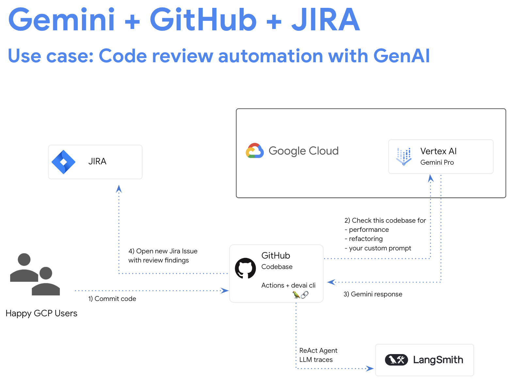

# GitHub - Code review automation with GenAI

This tutorial utilizes Gemini to assist with code reviews within the CICD process. An example integration and workflow are included to demonstrate the capabilities and bootstrap your effort. Additional modifications and customizations can be made by providing your own prompts as well as extending the provided CLI tool.

In this tutorial you will:

- Configure GCP for access to Gemini APIs
- Configure GitHub to integrate with GCP
- Review GitHub workflow and Gemini API calls
- Execute a CICD job and Review GenAI output

## Get Started

- Open the [google cloud console](https://console.cloud.google.com/)
- Activate Cloud Shell

## Configure GCP for access to Gemini APIs

The following steps prepare your Google Cloud project to enable and access Gemini API through Vertex.

### Enable APIs

In the opened terminal, enable required services to use Vertex AI APIs and Gemini chat.

```sh
gcloud services enable \
    aiplatform.googleapis.com \
    cloudaicompanion.googleapis.com \
    cloudresourcemanager.googleapis.com \
    secretmanager.googleapis.com
```

If prompted to authorize, click "Authorize" to continue.

### Create Service Account in GCP

Run following commands to create a new service account and download the keys to your workspace.

You will use this service account to make API calls to Vertex AI Gemini API from CICD pipelines.

```sh
PROJECT_ID=$(gcloud config get-value project)
SERVICE_ACCOUNT_NAME='vertex-client'
DISPLAY_NAME='Vertex Client'
KEY_FILE_NAME='vertex-client-key'

gcloud iam service-accounts create $SERVICE_ACCOUNT_NAME --display-name "$DISPLAY_NAME"

gcloud projects add-iam-policy-binding $PROJECT_ID --member="serviceAccount:$SERVICE_ACCOUNT_NAME@$PROJECT_ID.iam.gserviceaccount.com" --role="roles/aiplatform.admin" --condition None

gcloud projects add-iam-policy-binding $PROJECT_ID --member="serviceAccount:$SERVICE_ACCOUNT_NAME@$PROJECT_ID.iam.gserviceaccount.com" --role="roles/secretmanager.secretAccessor" --condition None

gcloud iam service-accounts keys create $KEY_FILE_NAME.json --iam-account=$SERVICE_ACCOUNT_NAME@$PROJECT_ID.iam.gserviceaccount.com
```

## Configure GitHub to integrate with GCP

### Fork the Repo

This tutorial uses a sample repository to demostrate the features. Start by forking the repo for your own use. 

- [Fork GitHub repo](https://github.com/GoogleCloudPlatform/genai-for-developers/fork)
- Select your github userid as an owner.
- Uncheck option to copy only the "main" branch.
- Click "Create fork".

### Enable GitHub Actions

A GitHub workflow is provided in the repo, however you will need to enable GitHub actions in your forked repo in order to run the process.

- Open the forked repo in the browser
- Switch to the "Actions" tab
- Enable GitHub workflows

### Add Repository Secrets

In this step you will create a repository secret to hold the GCP API credentials and make them available to Actions within this repo.

- In your GCP terminal run the following command to view the GCP secret created earlier.

```sh
cat ~/vertex-client-key.json
```

- Copy the secret output to your clipboard. You'll paste it in the following steps

- In GitHub, navigate to "Settings -> Secrets and variables -> Actions" in the GitHub repository.
- Add Repository secret called "GOOGLE_API_CREDENTIALS"
- Paste the secret you copied earlier into the value field for the secret.
- Click Add Secret
- Follow the same steps to add `PROJECT_ID`=your-gcp-project and `LOCATION`=us-central1 secrets

### Run GitHub Actions Workflow

Navigate to your GitHub repository in the browser and run the workflow - `GenAI For Developers`.
The workflow is configured to run on code push or manual execution.

### Review GitHub Actions Workflow output

You can review the execution and resulting summary in GitHub.

- In the browser, Open the GitHub "Actions" tab and review the workflow output.
- When the job completes click on Summary and scroll down to see the AI generated output.


### Clone the repository locally

Return to the Cloud Shell terminal and clone the repository.
Change YOUR-GITHUB-USERID to your GitHub userid before running the commands.

```sh
git clone https://github.com/YOUR-GITHUB-USERID/genai-for-developers.git 
```

Change into the directory before continuing with the rest of the tutorial.

```sh
cd genai-for-developers
```

## Review GitHub workflow and Gemini API calls

### Review GitHub workflow

Open the GitHub workflow by opening the file below.

```sh
cloudshell edit .github/workflows/devai-review.yml 
```

Review the tasks at the bottom of the file that use the `devai` cli. 

For example the code review step includes `devai review code -c [source to review]`

### Review command and Gemini API calls

In cloudshell you can open the specific file with the following command.

```sh
cloudshell edit devai-cli/src/devai/commands/review.py 
```

Review the prompt used in the `code` function. The function begins with

```py
@click.command(name='code')
@click.option('-c', '--context', required=False, type=str, default="")
def code(context):
```

Review the other functions and prompts used in this workflow such as testcoverage, performance, security, blockers.


## Integrations

Take a look at other tutorials to enable integrations with [JIRA](../setup-jira.md), [GitLab](../setup-gitlab.md) and [LangSmith](../setup-langsmith.md).