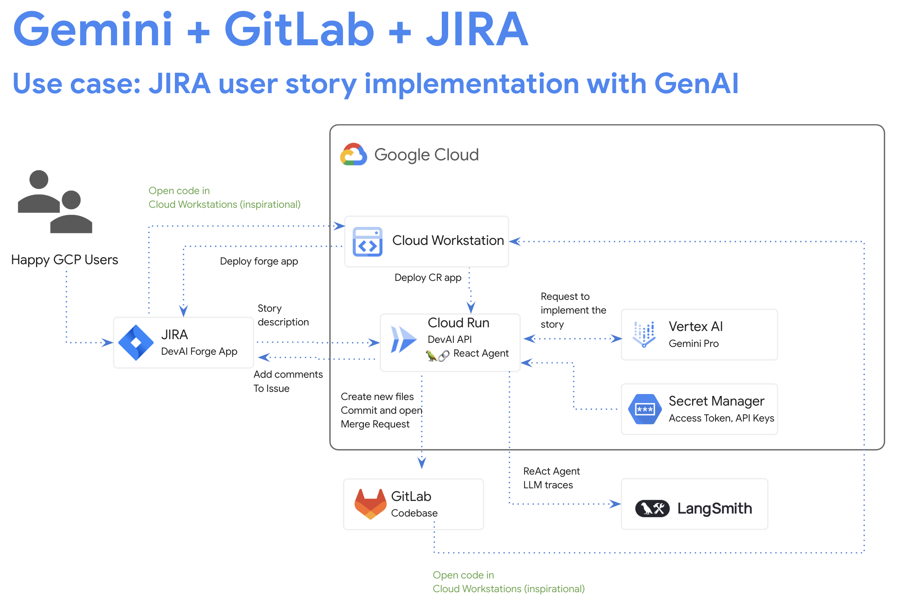
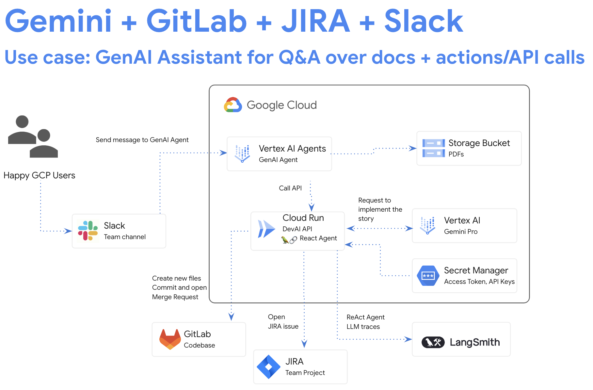

## DEVAI CLI - Image analysis

This example demonstrates ways to integrate LLM models into a custom command line utility for use by developers both locally and part of CICD pipeline to automate image analisys.

### CLI Setup steps

Follow this tutorial to setup DEVAI CLI - [setup-cli](../setup-cli.md).


### Image analysis command:

Update the path to the images in the cloned repository:
```
devai review imgdiff \
  -c ~/genai-for-developers/images/devai-api.png \
  -t ~/genai-for-developers/images/devai-api-slack.png  
```

### Sample output:
---
## Comprehensive Comparison of Image 1 and Image 2

These images illustrate different use cases for integrating Gemini with other platforms like GitLab, Jira, and potentially Slack. While sharing core components, distinct elements set them apart:

**Elements Absent in Image 2 (Compared to Image 1):**

1. **Slack Integration:** 
    * **Reasoning:** Image 1 prominently features Slack ("Team channel," "Send message to GenAI Agent"), entirely absent in Image 2.
    * **Methodology:**  Direct visual comparison; Image 2 lacks any Slack icon or related text.
2. **Storage Bucket (with PDFs):**
    * **Reasoning:** Image 1 connects "Vertex AI Agents" to a "Storage Bucket" containing "PDFs." This element, crucial for the "Q&A over docs" aspect, is missing from Image 2.
    * **Methodology:** Visual inspection confirms Image 2 focuses on code-related actions ("Cloud Workstation," "Deploy CR app," etc.) without referencing document storage.
3. **GenAI Agent Role as "Assistant":**
    * **Reasoning:** Image 1 explicitly states "GenAI Assistant" in the use case description, implying user interaction and assistance. Image 2 lacks this, focusing on "JIRA user story implementation."
    * **Methodology:**  Textual analysis of use case titles highlights the different roles envisioned for GenAI in each scenario.
4. **Direct JIRA Issue Creation:**
    * **Reasoning:** Image 1 depicts a flow where actions can directly "Open JIRA issue." Image 2 connects to Jira for "Story description" and "Add comments" but not explicit issue creation.
    * **Methodology:** Examination of process flow arrows reveals this difference in how JIRA is utilized.

**Elements Absent in Image 1 (Compared to Image 2):**

1. **Cloud Workstation:**
    * **Reasoning:** Image 2 showcases a "Cloud Workstation" used to "Deploy CR app," suggesting a hands-on development environment absent in Image 1's more automated flow.
    * **Methodology:**  Image 1 lacks any visual or textual reference to a dedicated development workstation within the process.
2. **"Happy GCP Users" interacting with Code:** 
    * **Reasoning:** Image 2 connects "Happy GCP Users" to "Open code in Cloud Workstations (inspirational)." Image 1 solely focuses on user interaction with the GenAI agent via Slack.
    * **Methodology:** Arrow direction in Image 2 implies users engaging with code directly, not just the agent as in Image 1.

**Conclusion:**

These images are NOT merely variations of the same system. They represent distinct use cases leveraging overlapping technology. Image 1 showcases a GenAI **assistant** for Q&A and task automation, relying heavily on Slack and document access. In contrast, Image 2 illustrates a GenAI-powered workflow for **JIRA user story implementation,** emphasizing code deployment and cloud workstations. 

---

### Image 1:


### Image 2:

